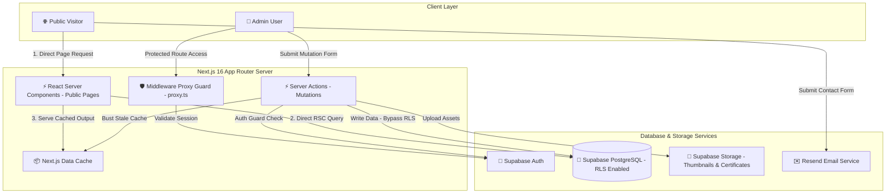
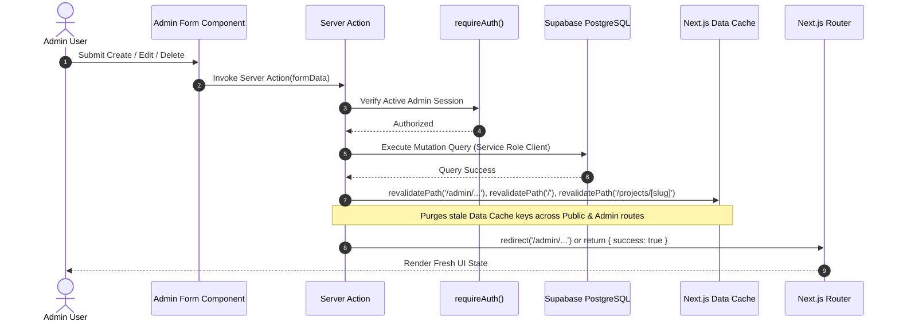

<div align="center">

# ⚡ Portfolio CMS — Ahmad Dhani Setiawan

**A high-performance, modern Fullstack Portfolio & Custom Admin CMS built with Next.js 16 (App Router), TypeScript, Supabase, Tailwind CSS v4, and Framer Motion.**

[](https://portfolio-dhani.vercel.app/)
[](https://nextjs.org/)
[](https://react.dev/)
[](https://www.typescriptlang.org/)
[](https://supabase.com/)
[](https://tailwindcss.com/)

</div>

---

## 📐 System Architecture

The project leverages Next.js React Server Components (RSC) for zero-JS-bundle read operations, paired with Server Actions for authenticated admin mutations. Supabase handles database storage, row-level security (RLS), and file management.



---

## 🔄 Cache Invalidation & Data Mutation Lifecycle

To guarantee instant UI updates without stale Data Cache, every Admin Server Action implements strict `revalidatePath()` triggers before completion.



---

## ✨ Key Features & Engineering Highlights

### 🌐 Public Portfolio

- **Parallax Scroll Hero**: Card stack transform animations with interactive smooth scroll (`framer-motion` + `motion/react`).
- **Dynamic Project Details**: Dynamic routes `/projects/[slug]` with interactive `ImageLightbox` previews and live/repository links.
- **Structured Experience Timeline**: Timeline entries formatted with bullet-point descriptions (`TEXT[]`) and tech stack badges.
- **Verified Credentials**: Public `/certificates` directory and homepage showcase with certificate verification links.
- **Global Interactions**: Click spark effects and micro-interactions calibrated to modern design standards.

### 🔐 Content Management System (Admin Panel)

- **Defense-in-Depth Authentication**: Route protection via `proxy.ts` middleware + explicit `requireAuth()` server-side execution guards.
- **Aceternity-Style Image Upload**: File uploader (`ImageUploadInput`) with drag-and-drop, image preview, Change/Remove state management, and 10MB client validation.
- **Dynamic Bullet List Input**: Custom list component for `experiences.description` with inline addition, removal, and Enter-key shortcuts.
- **Tech Stack Tag Selector**: Multi-select chip input powered by curated tech stack options (`TECH_STACK_OPTIONS`).
- **Skills Visibility Control**: Dedicated toggle controls to show/hide skills on public views without deleting database entries.

---

## 🗺️ Application Map

| Route                 | View Type        | Description                                                                       |
| :-------------------- | :--------------- | :-------------------------------------------------------------------------------- |
| `/`                   | Public RSC       | Hero, Featured Projects, Timeline Experiences, Skills, Certificates, Contact Form |
| `/projects/[slug]`    | Public RSC       | Detailed breakdown of specific projects with full descriptions & stack tags       |
| `/certificates`       | Public RSC       | Comprehensive directory of all credentials and professional certifications        |
| `/admin/login`        | Client Component | Admin authentication page with Supabase Auth session creation                     |
| `/admin/projects`     | Protected Admin  | Projects CRUD table with live status, display order, and media upload             |
| `/admin/experiences`  | Protected Admin  | Work history CRUD form featuring dynamic bullet-point input                       |
| `/admin/skills`       | Protected Admin  | Skill matrix CRUD with category grouping & visibility toggles                     |
| `/admin/certificates` | Protected Admin  | Credentials CRUD table with credential verification link management               |

---

## 🛠️ Tech Stack & Architecture Matrix

```
┌─────────────────────────────────────────────────────────────────────────────┐
│                            FRONTEND & CORE FRAMEWORK                        │
├─────────────────┬───────────────────────────────────────────────────────────┤
│ Core            │ Next.js 16.2 (App Router), React 19, TypeScript (Strict) │
│ Styling         │ Tailwind CSS v4, shadcn/ui, Radix UI Primitives           │
│ Animation       │ Framer Motion, Tabler Icons, Lucide React                 │
│ Notifications   │ Sonner Toast System                                       │
└─────────────────┴───────────────────────────────────────────────────────────┘
┌─────────────────────────────────────────────────────────────────────────────┐
│                            BACKEND & INFRASTRUCTURE                         │
├─────────────────┬───────────────────────────────────────────────────────────┤
│ Database        │ Supabase PostgreSQL (with RLS Policies)                   │
│ Authentication  │ Supabase Auth (Single Admin User)                         │
│ Storage         │ Supabase Storage Buckets (Public Read / Admin Write)      │
│ Email API       │ Resend API Integration                                    │
│ Hosting         │ Vercel Edge Platform                                      │
└─────────────────┴───────────────────────────────────────────────────────────┘
```

---

## 🗄️ Database Schema & Migration Files

All database tables are versioned under `supabase/schema/`:

```
supabase/schema/
├── 01_projects.sql                         # Projects table, triggers, & RLS policies
├── 02_experiences.sql                      # Experiences table schema & display ordering
├── 03_skills.sql                           # Skills category check constraints & visibility
├── 04_certificates.sql                     # Credentials table & featured flag settings
└── 05_experiences_description_array.sql   # Migration altering description TEXT -> TEXT[]
```

---

## 🚀 Local Development Setup

### 1. Prerequisites

- Node.js `>=20.0.0`
- npm or pnpm
- A Supabase Project instance

### 2. Environment Variables

Create a `.env.local` file in the root directory:

```env
# Supabase Configuration
NEXT_PUBLIC_SUPABASE_URL=https://your-supabase-project.supabase.co
NEXT_PUBLIC_SUPABASE_ANON_KEY=your-supabase-anon-key
SUPABASE_SERVICE_ROLE_KEY=your-supabase-service-role-key

# Email Service
RESEND_API_KEY=re_your_resend_api_key
```

### 3. Installation & Run

```bash
# Install dependencies
npm install

# Run SQL Migrations in Supabase Dashboard (or CLI)
# Execute SQL files in order from supabase/schema/*.sql

# Start development server
npm run dev
```

Open [http://localhost:3000](http://localhost:3000) to view the application locally.

---

<div align="center">

Designed & Developed by **Dhani Setiawan** • Deployed on **Vercel**

</div>
