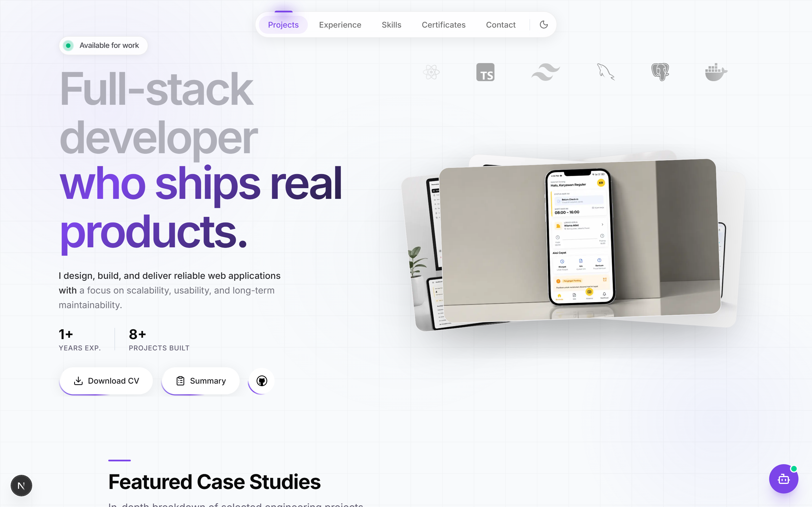
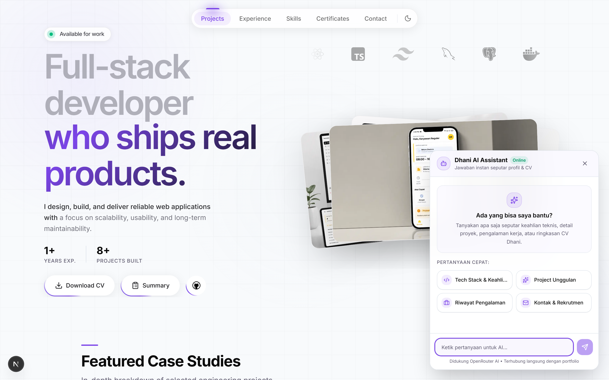
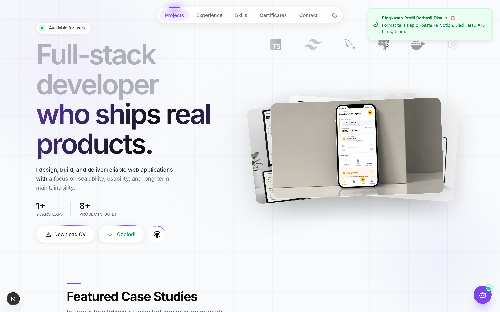
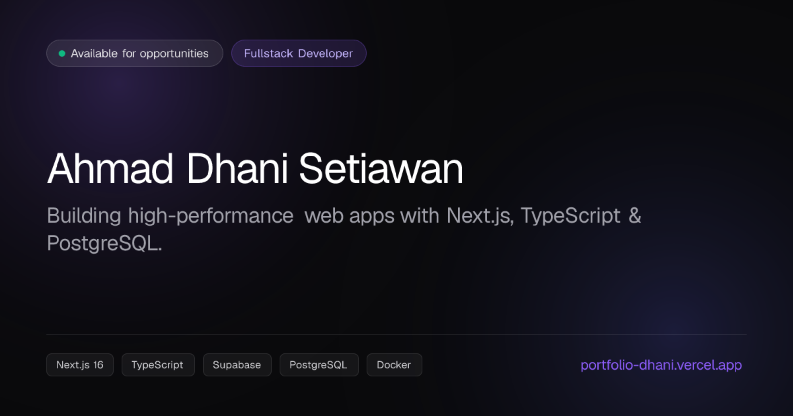
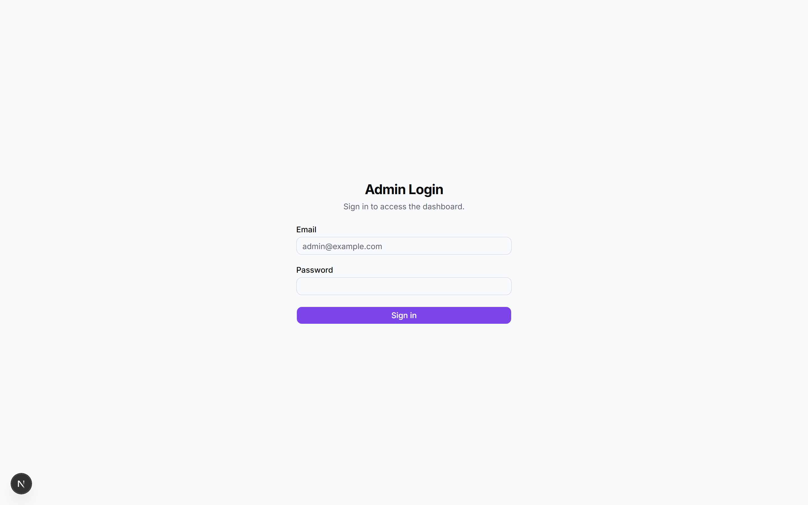

<div align="center">

# ⚡ Ahmad Dhani Setiawan — Fullstack Portfolio & AI Assistant

**A high-performance, modern Fullstack Portfolio & CMS built with Next.js 16 (App Router), React 19, TypeScript, Supabase PostgreSQL, Upstash Redis, Vercel AI SDK, and Tailwind CSS.**

[](https://portfolio-dhani.vercel.app/)
[](https://nextjs.org/)
[](https://react.dev/)
[](https://www.typescriptlang.org/)
[](https://supabase.com/)
[](https://upstash.com/)
[](https://openrouter.ai/)
[](https://playwright.dev/)

<br />

<a href="https://portfolio-dhani.vercel.app/">
  
</a>

</div>

---

## 🖼️ Visual Showcase

|                       🤖 AI Assistant (Grounded LLM & Streaming)                        |                                   💼 Recruiter Quick-Packet (1-Click Copy)                                   |
| :-------------------------------------------------------------------------------------: | :----------------------------------------------------------------------------------------------------------: |
|  |  |
| _Vercel AI SDK chat widget grounded in Supabase data with Upstash Redis rate limiting._ |               _1-Click candidate dossier copy for recruiters with Sonner toast notification._                |

|                            🖼️ Dynamic OpenGraph Engine (`next/og`)                            |                              🔐 Admin CMS & Control Panel                              |
| :-------------------------------------------------------------------------------------------: | :------------------------------------------------------------------------------------: |
|  |  |
|      _Automated 1200×630 social share cards generated dynamically per page and project._      |    _Single-admin CMS powered by shadcn/ui sidebar-07 with proxy route protection._     |

---

## 📐 System Architecture

The architecture uses **React Server Components (RSC)** for zero-JS read operations, **Server Actions** for authenticated admin mutations, and a streaming **AI Route Handler** with distributed rate limiting.

```mermaid
graph TD
    subgraph Client ["Client Layer"]
        PublicUser["🌐 Public Visitor / HR"]
        AdminUser["🔐 Admin User"]
        AIChatWidget["🤖 AI Chat Widget"]
    end

    subgraph NextServer ["Next.js 16 App Router Server"]
        RSC["⚡ React Server Components - Public Pages"]
        ProxyGuard["🛡️ Middleware Proxy Guard - proxy.ts"]
        ServerActions["⚡ Server Actions - Admin Mutations"]
        AIRouteHandler["🤖 AI Route Handler - /api/ai"]
        DynamicOG["🖼️ Dynamic OpenGraph Engine - next/og"]
        SitemapEngine["🗺️ Dynamic XML Sitemap & Robots"]
        DataCache["📦 Next.js Data Cache"]
    end

    subgraph Backend ["Cloud, AI & Storage Services"]
        SupaAuth["🔑 Supabase Auth"]
        SupaDB[("🐘 Supabase PostgreSQL - RLS Enabled")]
        SupaStore["📁 Supabase Storage - PDF CV & Media"]
        OpenRouterAPI["🧠 OpenRouter LLM - Gemini / Llama"]
        UpstashRedis["⚡ Upstash Redis - Sliding Window Limiter"]
        ResendMail["✉️ Resend Email Service"]
    end

    %% Public Flow
    PublicUser -->|1. Request Page / Projects| RSC
    RSC -->|2. Direct Server Query| SupaDB
    RSC -->|3. Serve Cached Output| DataCache
    PublicUser -->|Social Link Preview| DynamicOG
    PublicUser -->|Crawler Indexing| SitemapEngine

    %% AI Flow
    AIChatWidget -->|Stream Question| AIRouteHandler
    AIRouteHandler -->|"Check Rate Limit (10 req/min/IP)"| UpstashRedis
    AIRouteHandler -->|Fetch Grounded Context & CV| SupaDB
    AIRouteHandler -->|Stream LLM Inference| OpenRouterAPI

    %% Admin Flow
    AdminUser -->|Protected Route Access| ProxyGuard
    ProxyGuard -->|Validate Session| SupaAuth
    AdminUser -->|Submit Mutation Form| ServerActions

    ServerActions -->|Auth Guard Check| SupaAuth
    ServerActions -->|Write Data - Bypass RLS| SupaDB
    ServerActions -->|Upload PDF / Media Assets| SupaStore
    ServerActions -->|Bust Stale Cache| DataCache

    %% Contact Form
    PublicUser -->|Submit Contact Form| ResendMail
```



---

## ⚡ Core Engineering Highlights

| Feature                            | Technical Architecture                                                   | Value Proposition                                                                                                                  |
| :--------------------------------- | :----------------------------------------------------------------------- | :--------------------------------------------------------------------------------------------------------------------------------- |
| **🤖 AI Assistant**                | Vercel AI SDK (`useChat`) + OpenRouter + Supabase Context Grounding      | Visitors can chat with an AI assistant that understands Ahmad Dhani's real work history, projects, and parsed CV in real time.     |
| **⚡ Upstash Redis Rate Limiting** | `@upstash/ratelimit` with Sliding Window (10 req / min per IP)           | Protects AI endpoints against token depletion, bots, and DDoS abuse with zero cold start penalty.                                  |
| **💼 Recruiter Quick-Packet**      | `navigator.clipboard` API + Sonner Toast + Dynamic Supabase Query        | Recruiter can copy an organized markdown/text hiring dossier in 1 second, ready to paste into Slack/Notion/ATS.                    |
| **💎 Pure Vector SVG Branding**    | Native `app/icon.svg` & `public/icon.svg` (< 1 KB)                       | Replaces default Vercel branding with a custom Geometric DS Monogram that scales infinitely at 0 KB build overhead.                |
| **📐 Dynamic Project Slicing**     | Server-side array slicing (`projects.slice(0,3)` vs `projects.slice(3)`) | Hero showcases top 3 featured works in 3D parallax stack; the catalog grid renders remaining projects without duplication.         |
| **🖼️ Dynamic OpenGraph Engine**    | `next/og` Edge `ImageResponse` (1200×630)                                | Generates custom social cards for `/` and per-project dynamic routes `/projects/[slug]` with stack tags and descriptions.          |
| **🔐 Admin CMS (`sidebar-07`)**    | shadcn/ui flat sidebar + `requireAuth()` Server Action guard             | Single-admin control panel with PDF CV parser (`pdf-parse`), visibility toggles, and atomic cache invalidation (`revalidatePath`). |

---

## 🔄 Cache Invalidation & Data Mutation Lifecycle

Every admin mutation strictly triggers multi-path cache invalidation before returning a success response, ensuring the Next.js Data Cache stays in sync across both public and admin views.


---

## 🛠️ Tech Stack & Infrastructure Matrix

| Category                  | Technologies                                                           |
| :------------------------ | :--------------------------------------------------------------------- |
| **Frontend Framework**    | Next.js 16.2 (App Router), React 19, TypeScript (Strict Mode)          |
| **UI & Styling**          | Tailwind CSS v4, shadcn/ui, Radix UI Primitives, Lucide Icons          |
| **Animation & Motion**    | Framer Motion, Kibo UI Marquee, Moving Border Shaders                  |
| **AI Assistant & LLM**    | Vercel AI SDK (`useChat`), OpenRouter API (Gemini 2.5 Flash / Llama 3) |
| **Rate Limiting & Cache** | Upstash Redis (Distributed REST API, Sliding Window)                   |
| **Database & Storage**    | Supabase PostgreSQL (Row Level Security), Supabase Storage Buckets     |
| **Authentication**        | Supabase Auth (Single Admin User with Middleware Proxy Guard)          |
| **Email Service**         | Resend API Integration                                                 |
| **Testing Suite**         | Playwright (11 E2E Tests), Vitest (25 Unit Tests)                      |
| **Deployment**            | Vercel Edge Network                                                    |

---

## 🧪 Automated Testing Suite

The repository contains an automated test suite with **36 total automated tests** (25 unit tests + 11 end-to-end tests):

```bash
# Run Vitest unit tests (AI context grounding, rate limiter, summary generator, actions)
npm run test

# Run Playwright E2E tests (Admin auth proxy protection, AI chat widget, recruiter copy, home)
npx playwright test
```

---

## 🚀 Local Development Setup

### 1. Prerequisites

- Node.js `>=20.0.0`
- npm or pnpm
- Supabase Project
- Upstash Redis Database
- OpenRouter API Key

### 2. Environment Variables

Create a `.env.local` file in the root directory:

```env
# Base URL
NEXT_PUBLIC_SITE_URL=http://localhost:3000

# Supabase
NEXT_PUBLIC_SUPABASE_URL=https://your-supabase-project.supabase.co
NEXT_PUBLIC_SUPABASE_PUBLISHABLE_KEY=your-supabase-publishable-key
SUPABASE_SERVICE_ROLE_KEY=your-supabase-service-role-key

# AI Assistant & Rate Limiter
OPENROUTER_API_KEY=sk-or-v1-your-openrouter-key
UPSTASH_REDIS_REST_URL=https://your-upstash-instance.upstash.io
UPSTASH_REDIS_REST_TOKEN=your-upstash-token

# Email Contact Form
RESEND_API_KEY=re_your_resend_api_key
```

### 3. Installation & Run

```bash
# Install dependencies
npm install

# Start local development server
npm run dev
```

Open [http://localhost:3000](http://localhost:3000) to view the portfolio.

---

<div align="center">

Designed & Developed with precision by **Ahmad Dhani Setiawan** • Deployed on **Vercel**

</div>
