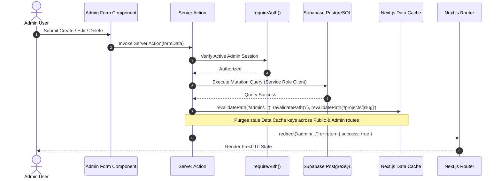

<div align="center">

# ⚡ Portfolio & AI Assistant CMS — Ahmad Dhani Setiawan

**A high-performance, modern Fullstack Portfolio & Custom Admin CMS built with Next.js 16 (App Router), React 19, TypeScript, Supabase, Tailwind CSS v4, Vercel AI SDK, and Framer Motion.**

[](https://portfolio-dhani.vercel.app/)
[](https://nextjs.org/)
[](https://react.dev/)
[](https://www.typescriptlang.org/)
[](https://supabase.com/)
[](https://openrouter.ai/)
[](https://tailwindcss.com/)

</div>

---

## 📐 System Architecture

The project leverages Next.js React Server Components (RSC) for zero-JS-bundle read operations, paired with Server Actions for authenticated admin mutations. An intelligent AI Assistant powered by Vercel AI SDK & OpenRouter is grounded in real-time portfolio data and CV content with Upstash Redis rate limiting.

```mermaid
graph TD
    subgraph Client ["Client Layer"]
        PublicUser["🌐 Public Visitor"]
        AdminUser["🔐 Admin User"]
        AIChatWidget["🤖 AI Chat Widget"]
    end

    subgraph NextServer ["Next.js 16 App Router Server"]
        RSC["⚡ React Server Components - Public Pages"]
        ProxyGuard["🛡️ Middleware Proxy Guard - proxy.ts"]
        ServerActions["⚡ Server Actions - Admin Mutations"]
        AIRouteHandler["🤖 AI Route Handler - /api/ai"]
        DynamicOG["🖼️ Dynamic OpenGraph Engine - next/og"]
        SitemapEngine["🗺️ Dynamic XML Sitemap & Robots"]
        DataCache["📦 Next.js Data Cache"]
    end

    subgraph Backend ["Cloud, AI & Storage Services"]
        SupaAuth["🔑 Supabase Auth"]
        SupaDB[("🐘 Supabase PostgreSQL - RLS Enabled")]
        SupaStore["📁 Supabase Storage - CVs & Project Thumbnails"]
        OpenRouterAPI["🧠 OpenRouter LLM API - Google Gemini / Meta Llama"]
        UpstashRedis["⚡ Upstash Redis - Distributed Rate Limiter"]
        ResendMail["✉️ Resend Email Service"]
    end

    %% Public Flow
    PublicUser -->|1. Request Page / Projects| RSC
    RSC -->|2. Direct Server Query| SupaDB
    RSC -->|3. Serve Cached Output| DataCache
    PublicUser -->|Social Link Preview| DynamicOG
    PublicUser -->|Crawler Indexing| SitemapEngine

    %% AI Flow
    AIChatWidget -->|Stream Question| AIRouteHandler
    AIRouteHandler -->|Check Rate Limit (10 req/min)| UpstashRedis
    AIRouteHandler -->|Fetch Grounded Context & CV| SupaDB
    AIRouteHandler -->|Stream LLM Inference| OpenRouterAPI

    %% Admin Flow
    AdminUser -->|Protected Route Access| ProxyGuard
    ProxyGuard -->|Validate Session| SupaAuth
    AdminUser -->|Submit Mutation Form| ServerActions

    ServerActions -->|Auth Guard Check| SupaAuth
    ServerActions -->|Write Data - Bypass RLS| SupaDB
    ServerActions -->|Upload PDF / Media Assets| SupaStore
    ServerActions -->|Bust Stale Cache| DataCache

    %% Contact Form
    PublicUser -->|Submit Contact Form| ResendMail
```

---

## 🔄 Cache Invalidation & Data Mutation Lifecycle

To guarantee instant UI updates without stale Data Cache, every Admin Server Action implements strict `revalidatePath()` triggers before completion.



---

## ✨ Key Features & Engineering Highlights

### 🤖 AI Assistant (Floating Widget & Grounded LLM)

- **Vercel AI SDK (`useChat`)**: Real-time streaming response with markdown formatting, code snippets, and quick suggestion pills.
- **Dynamic Context Grounding**: System prompt automatically synchronizes with active projects, work history, technical skills, certifications, and parsed CV text stored in Supabase.
- **Distributed Rate Limiting**: Upstash Redis sliding-window rate limiter protecting against spam and API abuse.
- **Custom Admin AI Config (`/admin/ai`)**: Dedicated control panel to configure custom system prompts, toggle active LLM models, and test responses in real-time.

### 🌐 Public Portfolio

- **Parallax Scroll Hero**: Card stack transform animations with interactive smooth scroll (`framer-motion`).
- **Dynamic Project Details**: Dynamic routes `/projects/[slug]` with interactive `ImageLightbox` previews and live/repository links.
- **Structured Experience Timeline**: Timeline entries formatted with bullet-point descriptions (`TEXT[]`) and tech stack badges.
- **Verified Credentials**: Public `/certificates` directory and homepage showcase with certificate verification links.
- **Dynamic OpenGraph Engine (`next/og`)**: High-resolution 1200×630 social share cards generated on-the-fly for homepage and individual project pages.
- **SEO & Structured Data**: Dynamic XML `sitemap.ts`, `robots.ts`, and Google Rich Results JSON-LD (`Person` & `CreativeWork` schemas).

### 🔐 Content Management System (Admin Panel)

- **shadcn/ui Sidebar-07 Architecture**: Collapsible sidebar (`Ctrl+B`), theme switcher dropdown, and responsive mobile sheet drawer.
- **Defense-in-Depth Authentication**: Route protection via `proxy.ts` middleware + explicit `requireAuth()` server-side execution guards.
- **Interactive CV Manager (`/admin/cv`)**: PDF upload to Supabase Storage with automatic server-side text extraction (`pdf-parse`) and resume download management.
- **Aceternity-Style Image Upload**: File uploader (`ImageUploadInput`) with drag-and-drop, image preview, Change/Remove state management, and 10MB client validation.
- **Dynamic Bullet List Input**: Custom list component for `experiences.description` with inline addition, removal, and Enter-key shortcuts.
- **Tech Stack Tag Selector**: Multi-select chip input powered by curated tech stack options.
- **Skills Visibility Control**: Dedicated toggle controls to show/hide skills on public views without deleting database entries.

---

## 🗺️ Application Map

| Route                 | View Type        | Description                                                                       |
| :-------------------- | :--------------- | :-------------------------------------------------------------------------------- |
| `/`                   | Public RSC       | Hero, Featured Projects, Timeline Experiences, Skills, Certificates, Contact Form |
| `/projects`           | Public RSC       | Complete archive of all public engineering projects                               |
| `/projects/[slug]`    | Public RSC       | Detailed breakdown of specific projects with full descriptions & stack tags       |
| `/certificates`       | Public RSC       | Comprehensive directory of all credentials and professional certifications        |
| `/api/ai`             | API Route        | Streaming AI chat endpoint with Upstash rate limiting and OpenRouter inference    |
| `/api/contact`        | API Route        | Contact message delivery via Resend API                                           |
| `/admin/login`        | Client Component | Admin authentication page with Supabase Auth session creation                     |
| `/admin`              | Protected Admin  | Admin control dashboard summary                                                   |
| `/admin/projects`     | Protected Admin  | Projects CRUD table with live status, display order, and media upload             |
| `/admin/experiences`  | Protected Admin  | Work history CRUD form featuring dynamic bullet-point input                       |
| `/admin/skills`       | Protected Admin  | Skill matrix CRUD with category grouping & visibility toggles                     |
| `/admin/certificates` | Protected Admin  | Credentials CRUD table with credential verification link management               |
| `/admin/cv`           | Protected Admin  | CV PDF upload, viewer, and automatic text extraction for AI context               |
| `/admin/ai`           | Protected Admin  | AI Assistant settings, custom prompt tuning, and model selection                  |

---

## 🛠️ Tech Stack & Architecture Matrix

```
┌─────────────────────────────────────────────────────────────────────────────┐
│                            FRONTEND & CORE FRAMEWORK                        │
├─────────────────┬───────────────────────────────────────────────────────────┤
│ Core            │ Next.js 16.2 (App Router), React 19, TypeScript (Strict) │
│ Styling         │ Tailwind CSS v4, shadcn/ui, Radix UI Primitives           │
│ Theme           │ next-themes (Light & Dark Mode)                           │
│ AI Client       │ Vercel AI SDK (useChat)                                   │
│ Animation       │ Framer Motion, Lucide Icons                               │
│ Notifications   │ Sonner Toast System                                       │
└─────────────────┴───────────────────────────────────────────────────────────┘
┌─────────────────────────────────────────────────────────────────────────────┐
│                            BACKEND & INFRASTRUCTURE                         │
├─────────────────┬───────────────────────────────────────────────────────────┤
│ Database        │ Supabase PostgreSQL (with RLS Policies)                   │
│ Authentication  │ Supabase Auth (Single Admin User)                         │
│ Storage         │ Supabase Storage Buckets (Public Read / Admin Write)      │
│ AI Inference    │ OpenRouter API (Google Gemini 2.5 Flash / Meta Llama 3)   │
│ Rate Limiting   │ Upstash Redis (Sliding Window Algorithm)                  │
│ Email API       │ Resend API Integration                                    │
│ SEO Engine      │ next/og ImageResponse, XML Sitemap, JSON-LD Schema        │
│ Testing         │ Playwright (E2E), Vitest (Unit)                           │
│ Hosting         │ Vercel Edge Platform                                      │
└─────────────────┴───────────────────────────────────────────────────────────┘
```

---

## 🗄️ Database Schema & Migration Files

All database tables and security policies are versioned under `supabase/schema/`:

```
supabase/schema/
├── 01_projects.sql                         # Projects table, triggers, & RLS policies
├── 02_experiences.sql                      # Experiences table schema & display ordering
├── 03_skills.sql                           # Skills category check constraints & visibility
├── 04_certificates.sql                     # Credentials table & featured flag settings
├── 05_experiences_description_array.sql   # Migration altering description TEXT -> TEXT[]
├── 06_profile_settings.sql                 # Profile metadata & CV storage references
└── 07_ai_settings.sql                      # AI prompt templates & active model config
```

---

## 🧪 Testing Suite

The repository contains an automated testing suite covering unit tests and end-to-end user workflows:

```bash
# Run Vitest unit tests (AI context grounding, rate limiting, utility functions)
npm run test

# Run Playwright E2E tests (Admin auth protection, AI chat widget, public pages)
npx playwright test
```

---

## 🚀 Local Development Setup

### 1. Prerequisites

- Node.js `>=20.0.0`
- npm or pnpm
- A Supabase Project instance
- An Upstash Redis database (for AI rate limiting)
- An OpenRouter API Key (for AI chat)

### 2. Environment Variables

Create a `.env.local` file in the root directory:

```env
# Base URL Configuration
NEXT_PUBLIC_SITE_URL=http://localhost:3000

# Supabase Configuration
NEXT_PUBLIC_SUPABASE_URL=https://your-supabase-project.supabase.co
NEXT_PUBLIC_SUPABASE_ANON_KEY=your-supabase-anon-key
SUPABASE_SERVICE_ROLE_KEY=your-supabase-service-role-key

# AI Assistant & Rate Limiting
OPENROUTER_API_KEY=sk-or-v1-your-openrouter-key
UPSTASH_REDIS_REST_URL=https://your-upstash-instance.upstash.io
UPSTASH_REDIS_REST_TOKEN=your-upstash-token

# Email Service (Contact Form)
RESEND_API_KEY=re_your_resend_api_key
```

### 3. Installation & Run

```bash
# Install dependencies
npm install

# Run SQL Migrations in Supabase Dashboard (or CLI)
# Execute SQL files in order from supabase/schema/*.sql

# Start development server
npm run dev
```

Open [http://localhost:3000](http://localhost:3000) to view the application locally.

---

<div align="center">

Designed & Developed by **Ahmad Dhani Setiawan** • Deployed on **Vercel**

</div>
