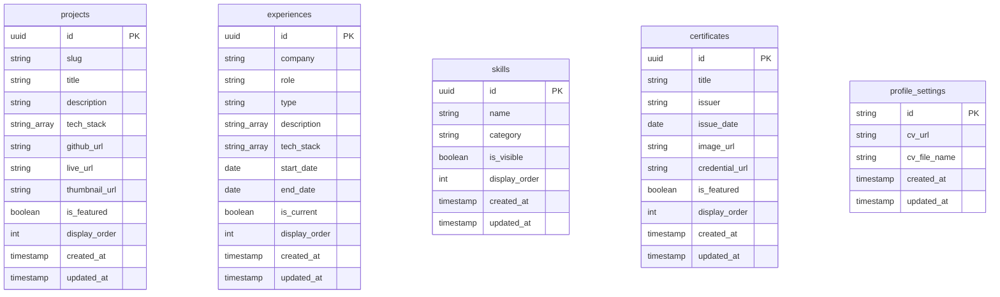

# docs/schema.md

Semua tabel independen, tidak ada relasi/foreign key antar tabel saat ini.

**Storage:**

- Bucket `thumbnails`: public, max 10MB, MIME jpeg/png/webp. Digunakan untuk projects dan certificates.
- Bucket `documents`: public, max 10MB, MIME application/pdf. Digunakan untuk CV / resume dinamis.
